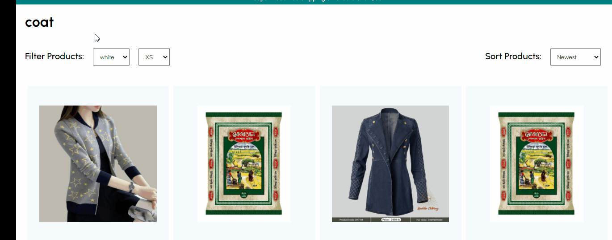

# MERN Ecommece Practice project 

> ### mern stack এর  প্রাকটিস এর জন্য  ecommerce  প্রজেক্ট করা 

> #### তাই  এই প্রজেক্ট এর ধারাবাহিক কাজ গুলো নোট  আকারে  লিখে রাখলাম 

> ###  STEP - 1
>> আমাদের কে রিএক্ট রাউটার  ইনস্টল করে  app.js   ফাইল এ   রিএক্ট রাউটার এ কানেক্ট করতে হবে


<details>
<summary>React  Router  connect  in App.js </summary>

```javascript
import Product from "./pages/Product";
import Home from "./pages/Home";
import ProductList from "./pages/ProductList";
import Register from "./pages/Register";
import Login from "./pages/Login";
import Cart from "./pages/Cart";
import {
  BrowserRouter as Router,
  Switch,
  Route,
  Redirect,
} from "react-router-dom";
import Success from "./pages/Success";
// import { useSelector } from "react-redux";

const user = true;

const App = () => {
  // const user = useSelector((state) => state.user.currentUser);
  return (
    <Router>
      <Switch>
        <Route exact path="/">
          <Home />
        </Route>
        <Route path="/products/:category">
          <ProductList />
        </Route>
        <Route path="/product/:id">
          <Product />
        </Route>
        <Route path="/cart">
          <Cart />
        </Route>
        <Route path="/success">
          <Success />
        </Route>
        <Route path="/login">{user ? <Redirect to="/" /> : <Login />}</Route>
        <Route path="/register">
          {user ? <Redirect to="/" /> : <Register />}
        </Route>
      </Switch>
    </Router>
  );
};

export default App;

```

</details>

<br/>

> ###  STEP - 2
>> আমাদের   প্রোডাক্টস দেখানো  লাগবে।  আর আমাদের প্রোডাক্ট গুলো দেখানোর প্রসেস গুলো নিম্ব লিস্ট  আকারে  দেওয়া হলো - 
আমাদের   প্রোডাক্টস দেখানো  লাগবে।  আর আমাদের প্রোডাক্ট গুলো দেখানোর প্রসেস গুলো নিম্ব লিস্ট  আকারে  দেওয়া হলো - 

- প্রথমে সকল প্রোডাক্টস দেখতে হবে 
- catagory সিলেক্ট করলে সেই অনুযায়ী দেখতে হবে 
- sort  সিলেক্ট করলে  সেই অনুযায়ী দেখানো লাগবে 


<details>
<summary>Get Products List  Component   Code ......    </summary>

```javascript

// product list  compoent  code 
  const location = useLocation();
  const cat = location.pathname.split("/")[2];
  const [filters, setFilters] = useState({});
  const [sort, setSort] = useState("newest");

  const handleFilters = (e) => {
    const value = e.target.value;
    setFilters({
      ...filters,
      [e.target.name]: value,
    });
  };

```
```javascript 
<Container>
    <Navbar />
      <Announcement />
      <Title>{cat}</Title>
      <FilterContainer>
        <Filter>
          <FilterText>Filter Products:</FilterText>

          {/* color  select  */}

          <Select name="color" onChange={handleFilters}>
            <Option disabled>Color</Option>
            <Option>white</Option>
            <Option>black</Option>
            <Option>red</Option>
            <Option>blue</Option>
            <Option>yellow</Option>
            <Option>green</Option>
          </Select>

          {/* product size  select  */}
          <Select name="size" onChange={handleFilters}>
            <Option disabled>Size</Option>
            <Option>XS</Option>
            <Option>S</Option>
            <Option>M</Option>
            <Option>L</Option>
            <Option>XL</Option>
          </Select>
        </Filter>
        <Filter>

          {/* product sort system  */}
          <FilterText>Sort Products:</FilterText>
          <Select onChange={(e) => setSort(e.target.value)}>
            <Option value="newest">Newest</Option>
            <Option value="asc">Price (asc)</Option>
            <Option value="desc">Price (desc)</Option>
          </Select>
        </Filter>

      </FilterContainer>

      {/* pass cat, filters  and sort  value  by props */}
      <Products cat={cat} filters={filters} sort={sort} />

      <Newsletter />
    <Footer />
</Container>

```

</details>


### Products List
>  প্রোডাক্টস গুলো দেখানোর  জন্য  ধাপগুলো নিম্নে দেওয়া হলো 

- দুটি স্টেট নিতে হবে প্রোডাক্টস এবং ফিল্টার প্রোডাক্টস 
- যদি ক্যাটাগরি থাকে তাহলে ক্যাটাগরি অনুযায়ী প্রোডাক্ট নিয়ে আসতে  হবে আর যদি না থাকে তাহলে  সকল প্রোডাক্ট নিয়ে আস্তে  হবে।  
- ক্যাটাগরি  যদি তাহলে তাহলে ফিল্টার  অনুযায়ী প্রোডাক্ট দেখানো 
- sort অনুযায়ী প্রোডাক্ট গুলো  দেখানো 
- প্রোডাক্ট দেখানোর সময় ক্যাটাগরি থাকলে  filtercatagory  দেখানো এবং না থাকলে সকল প্রোডাক্ট দেখানো লাগবে 



<details>
<summary> Products file code  ......    </summary>

```javascript 
import { useEffect, useState } from "react";
import styled from "styled-components";
import { popularProducts } from "../data";
import Product from "./Product";
import axios from "axios";

const Container = styled.div`
  padding: 20px;
  display: flex;
  flex-wrap: wrap;
  justify-content: space-between;
`;

const Products = ({ cat, filters, sort }) => {
  const [products, setProducts] = useState([]);
  const [filteredProducts, setFilteredProducts] = useState([]);

  useEffect(() => {
    const getProducts = async () => {
      try {
        const res = await axios.get(
          cat
            ? `http://localhost:5000/api/products?category=${cat}`
            : "http://localhost:5000/api/products"
        );
        setProducts(res.data);
      } catch (err) {}
    };
    getProducts();
  }, [cat]);

  useEffect(() => {
    cat &&
      setFilteredProducts(
        products.filter((item) =>
          Object.entries(filters).every(([key, value]) =>
            item[key].includes(value)
          )
        )
      );
  }, [products, cat, filters]);

  useEffect(() => {
    if (sort === "newest") {
      setFilteredProducts((prev) =>
        [...prev].sort((a, b) => a.createdAt - b.createdAt)
      );
    } else if (sort === "asc") {
      setFilteredProducts((prev) =>
        [...prev].sort((a, b) => a.price - b.price)
      );
    } else {
      setFilteredProducts((prev) =>
        [...prev].sort((a, b) => b.price - a.price)
      );
    }
  }, [sort]);

  return (
    <Container>
      {cat
        ? filteredProducts.map((item) => <Product item={item} key={item.id} />)
        : products
            .slice(0, 8)
            .map((item) => <Product item={item} key={item.id} />)}
    </Container>
  );
};

export default Products;


````
</details>


<details>
<summary> Product file code  ......    </summary>

```javascript

import { Add, Remove } from "@material-ui/icons";
import styled from "styled-components";
import Announcement from "../components/Announcement";
import Footer from "../components/Footer";
import Navbar from "../components/Navbar";
import Newsletter from "../components/Newsletter";
import { mobile } from "../responsive";
import { useLocation } from "react-router-dom";
import { useEffect, useState } from "react";
import { publicRequest } from "../requestMethods";
import { addProduct } from "../redux/cartRedux";
import { useDispatch } from "react-redux";

const Container = styled.div``;

const Wrapper = styled.div`
  padding: 50px;
  display: flex;
  ${mobile({ padding: "10px", flexDirection: "column" })}
`;

const ImgContainer = styled.div`
  flex: 1;
`;

const Image = styled.img`
  width: 100%;
  height: 90vh;
  object-fit: cover;
  ${mobile({ height: "40vh" })}
`;

const InfoContainer = styled.div`
  flex: 1;
  padding: 0px 50px;
  ${mobile({ padding: "10px" })}
`;

const Title = styled.h1`
  font-weight: 200;
`;

const Desc = styled.p`
  margin: 20px 0px;
`;

const Price = styled.span`
  font-weight: 100;
  font-size: 40px;
`;

const FilterContainer = styled.div`
  width: 50%;
  margin: 30px 0px;
  display: flex;
  justify-content: space-between;
  ${mobile({ width: "100%" })}
`;

const Filter = styled.div`
  display: flex;
  align-items: center;
`;

const FilterTitle = styled.span`
  font-size: 20px;
  font-weight: 200;
`;

const FilterColor = styled.div`
  width: 20px;
  height: 20px;
  border-radius: 50%;
  background-color: ${(props) => props.color};
  margin: 0px 5px;
  cursor: pointer;
`;

const FilterSize = styled.select`
  margin-left: 10px;
  padding: 5px;
`;

const FilterSizeOption = styled.option``;

const AddContainer = styled.div`
  width: 50%;
  display: flex;
  align-items: center;
  justify-content: space-between;
  ${mobile({ width: "100%" })}
`;

const AmountContainer = styled.div`
  display: flex;
  align-items: center;
  font-weight: 700;
`;

const Amount = styled.span`
  width: 30px;
  height: 30px;
  border-radius: 10px;
  border: 1px solid teal;
  display: flex;
  align-items: center;
  justify-content: center;
  margin: 0px 5px;
`;

const Button = styled.button`
  padding: 15px;
  border: 2px solid teal;
  background-color: white;
  cursor: pointer;
  font-weight: 500;

  &:hover {
    background-color: #f8f4f4;
  }
`;

const Product = () => {
  const location = useLocation();
  const id = location.pathname.split("/")[2];
  const [product, setProduct] = useState({});
  const [quantity, setQuantity] = useState(1);
  const [color, setColor] = useState("");
  const [size, setSize] = useState("");
  const dispatch = useDispatch();

  useEffect(() => {
    const getProduct = async () => {
      try {
        const res = await publicRequest.get("/products/find/" + id);
        setProduct(res.data);
      } catch {}
    };
    getProduct();
  }, [id]);

  const handleQuantity = (type) => {
    if (type === "dec") {
      quantity > 1 && setQuantity(quantity - 1);
    } else {
      setQuantity(quantity + 1);
    }
  };

  const handleClick = () => {
    dispatch(
      addProduct({ ...product, quantity, color, size })
    );
  };
  return (
    <Container>
      <Navbar />
      <Announcement />
      <Wrapper>
        <ImgContainer>
          <Image src={product.img} />
        </ImgContainer>
        <InfoContainer>
          <Title>{product.title}</Title>
          <Desc>{product.desc}</Desc>
          <Price>$ {product.price}</Price>
          <FilterContainer>
            <Filter>
              <FilterTitle>Color</FilterTitle>
              {product.color?.map((c) => (
                <FilterColor color={c} key={c} onClick={() => setColor(c)} />
              ))}
            </Filter>
            <Filter>
              <FilterTitle>Size</FilterTitle>
              <FilterSize onChange={(e) => setSize(e.target.value)}>
                {product.size?.map((s) => (
                  <FilterSizeOption key={s}>{s}</FilterSizeOption>
                ))}
              </FilterSize>
            </Filter>
          </FilterContainer>
          <AddContainer>
            <AmountContainer>
              <Remove onClick={() => handleQuantity("dec")} />
              <Amount>{quantity}</Amount>
              <Add onClick={() => handleQuantity("inc")} />
            </AmountContainer>
            <Button onClick={handleClick}>ADD TO CART</Button>
          </AddContainer>
        </InfoContainer>
      </Wrapper>
      <Newsletter />
      <Footer />
    </Container>
  );
};

export default Product;


```

</details>